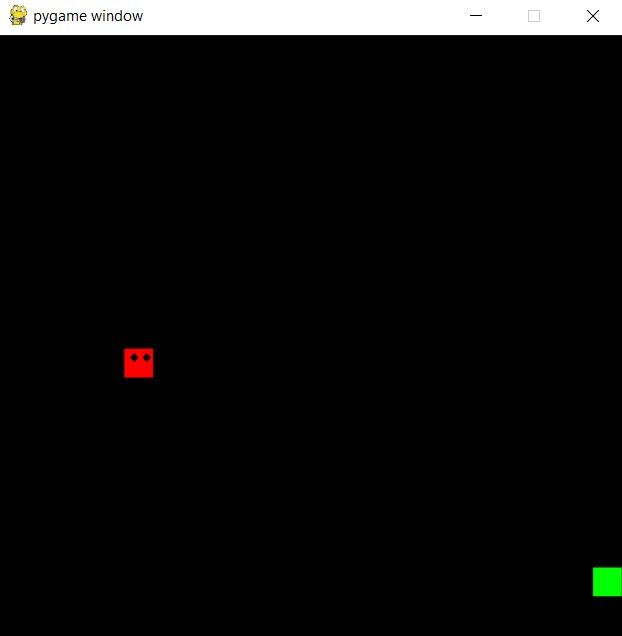
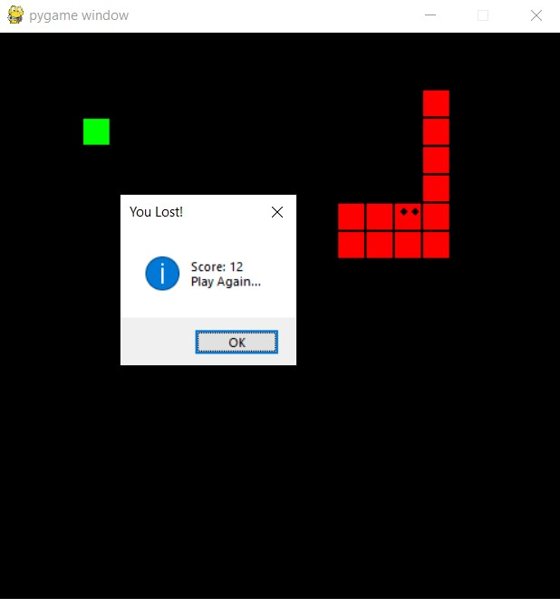

##### This is the snake game in python designed using the tkinter

### Libraries used
##### tkinter (to install this use pip install tkinter)
##### pygame (to install this use pip install pygame)
##### math
##### random

### How to run the game

##### Run the game.py file to start the game.

### Points to keep in mind

##### If your snake is moving from left to right and you press left key, game will be over.

##### If your snake is moving from right to left and you press right key, game will be over.

##### If your snake is moving from down to up and you press down key, game will be over.

##### If your snake is moving from up to down and you press up key, game will be over.

##### Points are calculated on the basis of food captures which will be displayed at the end of the game.

  

  
